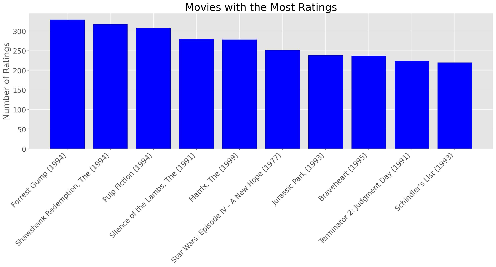
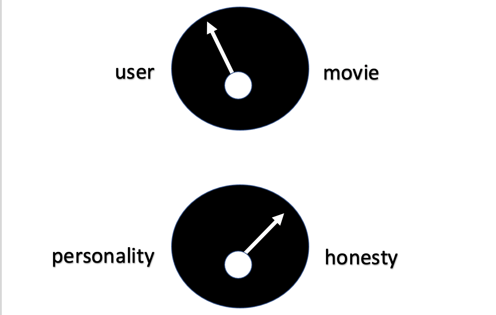
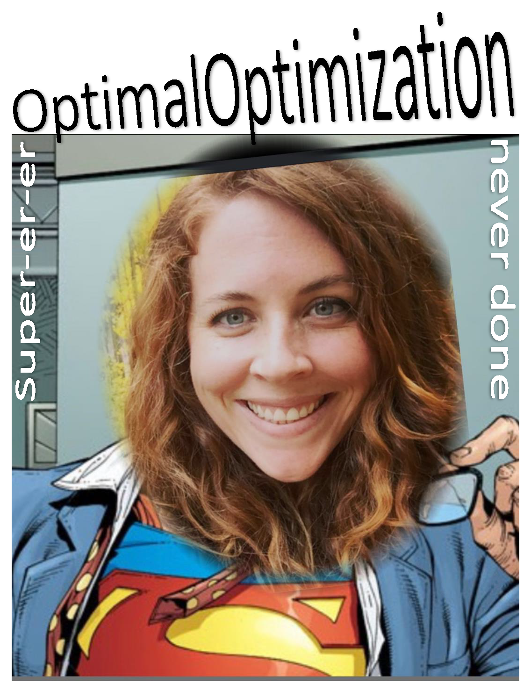

<div align="center">  
<header>
    <h1>Movies-Legit<br>
    New Movie Recommender Pitch</h1>
  </header>
<div align='left'>  

 
[source](https://www.facebook.com/MRPJD/photos/a.113642393607538/116536716651439)  


## Table of Contents
1. [Background](#background)
2. [Data](#data)
3. [Analysis and Business Advice](#analysis-and-business-advice)
4. [New and Innovative Models in Development](#new-and-innovative-models-in-development)

## Background

Our data science team has been tasked with proposing a new movie recommender platform for **Movies-Legit**.   

Currently, the company uses their **Mean of Means** solution, which captures the general per-user and per-item trends of rating movies. If there are any missing ratings, the model averages the global mean along with the mean of the user and item ratings to fill in the value.   


## Data  

### Initial Data
The data used to evaluate the current **Mean of Means** model, as well as build our new recommender model is from the [MovieLens dataset](https://grouplens.org/datasets/movielens/). The small sample dataset we are using consists of four csv files:
-  ```movies.csv```: 193,609 movies listed with a unique ```movieId```, their title and the genres to which the movie belongs--our small sample has about 9,700 movies
-  ```ratings.csv```: Ratings ranging between 0.5 to 5.0 from 610 users with unique ```userId``` for various movies linked by their unique ```movieId```
-  ```tags.csv```: User identified keyword/words tags for each movie specified by the unique ```userId``` and ```movieId```
-  ```links.csv``` : Specific IDs for IMDB and TMIBD, which are sourced movie and TV databases

We used SQL with PySpark to do initial EDA on our data and found these were the top 10 most rated movies.



### Density Problem : 0.017
Of all the places that could have information, we only have 1.7% of that information! We need to find a more reliable and quick model to fill in the recommendations on movies users have not seen.


## Analysis and Business Advice
Nobody wants to look at all these numbers, so don't, but please know how proud we are of all of our great results! We have 10 of 11 models that improve the current recommendation results. 
|    **Algorithm**    | **5-Fold CrossVal RMSE** | **% Improvement Over GlobalMean** | **% Improvement Over MeanOfMeans** | **Fit Time**   | **Test Time** |
|:-----------------:|:----------------------:|:-------------------------------:|:--------------------------------:|:------------:|:-----------:|
| SVDpp           | 0.860833             | 17.429158                     | 7.510634                       | 458.891514 | 9.244243  |
| BaselineOnly    | 0.872352             | 16.324263                     | 6.273017                       | 0.202521   | 0.116606  |
| SVD             | 0.874329             | 16.134664                     | 6.060644                       | 4.278943   | 0.152708  |
| **KNNBaseline**     | **0.874614**    | **16.107319**         | **6.030014**                  | **0.301779**   | **1.793125**  |
| KNNWithZScore   | 0.896911             | 13.968609                     | 3.634399                       | 0.182884   | 1.687832  |
| KNNWithMeans    | 0.897265             | 13.934625                     | 3.596333                       | 0.131177   | 1.488005  |
| SlopeOne        | 0.901140             | 13.562966                     | 3.180030                       | 4.169153   | 6.961816  |
| NMF             | 0.923342             | 11.433280                     | 0.794523                       | 5.260941   | 0.147786  |
| CoClustering    | 0.946046             | 9.255583                      | -1.644761                      | 2.333242   | 0.212232  |
| KNNBasic        | 0.948321             | 9.037341                      | -1.889219                      | 0.111074   | 1.398065  |
| NormalPredictor  | 1.427467             | -36.922246                    | -53.369536                     | 0.129567   | 0.216776  |

### Choosing a New Recommender Model

* SVDpp did perform the best but also had a drasticly longer Fit time
* SVD also had a strong performance but compared to the BaselineOnly & KNNBaseline models had a Fit Time more than 20x 

* **Select the BaselineOnly & KNNBaseline**
  * (Fastest) BaselineOnly algorithm predicts the baseline estimate for given user and movie.
  * (Generate Movie Neighbors) KNNBaseline is a basic collaborative filtering algorithm taking into account a baseline rating (0.5).
<br>  

**10 Recommended Movies if you like these top rated movies:**  

|  Forrest Gump (1994): | Shawshank Redemption, The (1994):    | Pulp Fiction (1994):                       |
|:-------------------------------------:|:-------------------------------:|:------------------------------------:|
| Inception (2010)                                        | Total Recall (1990)                  | Enemy of the State (1998)                  |
| Swan Princess, The (1994)                               | Road Warrior, The (Mad Max 2) (1981) | Dark Knight Rises, The (2012)              |
| Congo (1995)                                            | Dark Knight Rises, The (2012)        | Clonus Horror, The (1979)                  |
| Lawnmower Man 2: Beyond Cyberspace (1996)               | Clonus Horror, The (1979)            | Billy Elliot (2000)                        |
| Silence of the Lambs, The (1991)                        | NeverEnding Story III, The (1994)    | Screamers (1995)                           |
| Groundhog Day (1993)                                    | Species (1995)                       | Rumble in the Bronx (Hont faan kui) (1995) |
| Enemy of the State (1998)                               | True Lies (1994)                     | Wolf of Wall Street, The (2013)            |
| Piano, The (1993)                                       | She’s the One (1996)                 | Big Green, The (1995)                      |
| Twelfth Night (1996)                                    | Red Dawn (1984)                      | Happy Gilmore (1996)      
  
## Inovative Solutions in Development
### **The Pedro**
This algorithm facilitates the ability to tune recommendations to areas of interest: 
* The user to movie dial
  * here we can choose how much to weight a user's own reviews versus a movie's overall reviews.
* The personality to honesty dial
  * the effect of users whose reviews don't vary much can be controlled here. The carmudgeon-factor and the I-only--give-reviews factor can be addressed here.  


### **We Met at the Movies**
Our models improve performance metrics, but it is difficult to make that meaningful in the context of what you really care about measuring. We are trying to measure how good you are at giving people what they want. What do people want in the context of movies? The same thing people want in the context of everything. Connection.  
Your product isn't movies. It's connection. Let's provide connection!   

> **kismet** fate, destiny, your movie soul-mates    

We have (almost) developed a way to walk through movies to each other and make new recommendations. 
This algorithm creates a group, a kismet, of people with the same movie-personality, and collection of recommended movies that the kismet hasn't seen. We would like to expand the rating interface to include space for kismets to connect by rating and discussing new movies. In addition to increasing personal connections, we are also genrating more data for better and better recommendations!
* users must opt-in to ensure that all kismet members are open to connection
* caveat that untoward behavior will buy them a ticket out of their kismet(s)

**BEST PART:** even unwanted recommendations give the kismet something to connect about...we are providing connection, remember?


<div align="center"> 

<div align='left'> 


## **End Notes**
##### Other Algorithms
* NormalPredictor
  - NormalPredictor algorithm predicts a random rating based on the distribution of the training set, which is assumed to be normal. This is one of the most basic algorithms that do not do much work.
* k-NN algorithms
  - KNNBasic
    - KNNBasic is a basic collaborative filtering algorithm.
  - KNNWithMeans
    - KNNWithMeans is basic collaborative filtering algorithm, taking into account the mean ratings of each user.
  - KNNWithZScore 
    - KNNWithZScore is a basic collaborative filtering algorithm, taking into account the z-score normalization of each user.
* Matrix Factorization-based algorithms
  - SVD
    - SVD algorithm is equivalent to Probabilistic Matrix Factorization
  - SVDpp
    - The SVDpp algorithm is an extension of SVD that takes into account implicit ratings.
  - NMF
    - NMF is a collaborative filtering algorithm based on Non-negative Matrix Factorization. It is very similar with SVD.
  - Slope One
    - SlopeOne is a straightforward implementation of the SlopeOne algorithm.
  - Co-clustering
    - Coclustering is a collaborative filtering algorithm based on co-clustering.